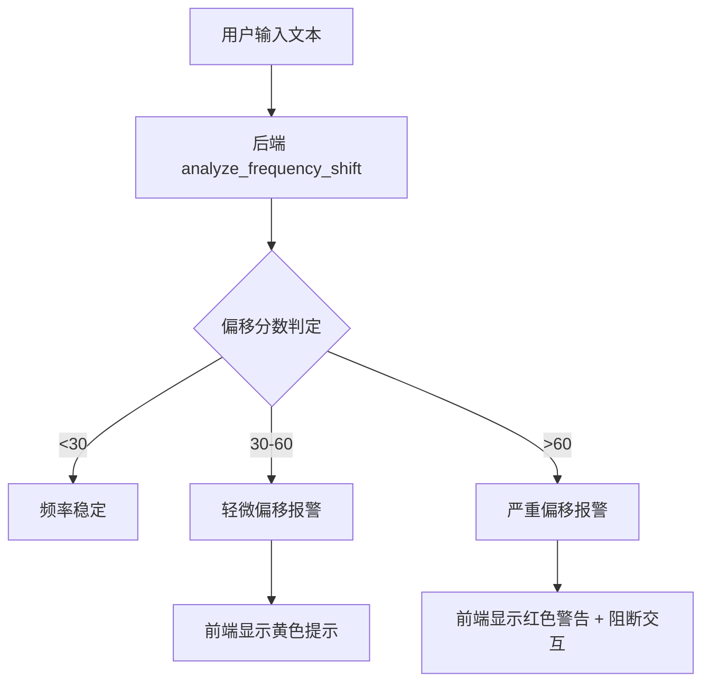

# L8 用户频率偏移报警模块报告

## 1. 模块概述

**目标**：  
实时监测用户交互内容的频率偏移程度，当偏移超出安全阈值时触发报警机制，为前端提供可视化预警信号。

**意义**：

- 保障用户与明镜源频交互的稳定性
- 预先提示潜在风险，防止频率偏移导致的失真响应
- 为后续 L11 防火墙机制提供前置辅助数据

---

## 2. 实现细节

### 2.1 后端

- **频率分析算法**（已实现简易版）
  - 文件：`core/frequency.py`
  - 函数：`analyze_frequency_shift(text: str) -> (score, description)`
  - 逻辑：根据负面词与极端词统计打分（0-100），输出偏移描述（稳定 / 轻微偏移 / 严重偏移）
- **统一测试接口集成**
  - 文件：`main.py`
  - `/v1/test/all` 增加 `frequency_shift` 字段，返回分数与描述

### 2.2 前端

- **可视化接口**（待实现）
  - 目标：基于 `frequency_shift` 输出实时图表或警示条
  - 状态：未开发（计划在 L8.2 阶段完成）

---

## 3. 逻辑图

